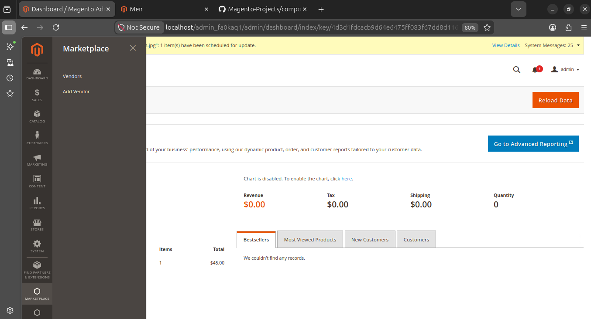
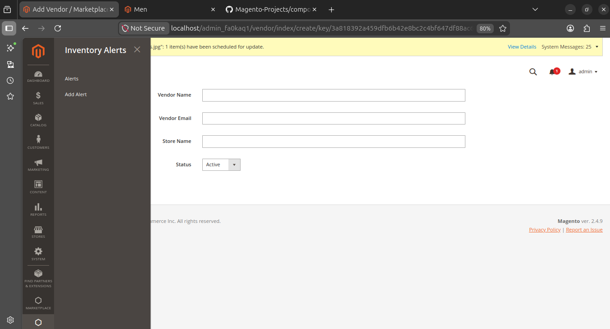
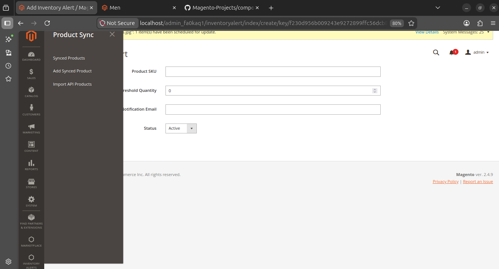
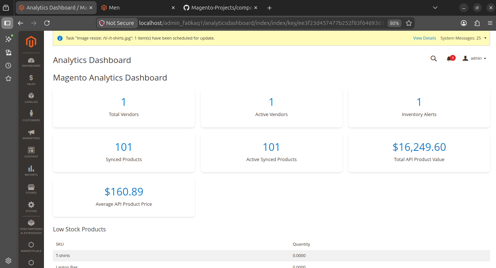

    # Magento 2 Portfolio Projects

This repository contains a Magento 2 development portfolio built with Docker, PHP, MySQL, OpenSearch, and Magento Admin custom modules.

## Projects Included

### 1. Magento 2 Fashion eCommerce Store
A responsive fashion eCommerce store built with Magento 2 featuring categories, products, configurable products, shopping cart, checkout, shipping, and payment configuration.

**Features**
- Product catalog management
- Simple and configurable products
- Category structure
- Inventory management
- Shipping and payment setup
- Custom homepage content

---

### 2. Multi-Vendor Marketplace Module
A custom Magento 2 admin module for managing marketplace vendors.

**Features**
- Custom admin menu
- Vendor database table
- Add vendor form
- Vendor listing page
- Activate/deactivate vendor
- Delete vendor
- Magento models, resource models, collections, controllers, and templates

---

### 3. Inventory Alert Management Module
A custom Magento 2 module for managing product inventory alerts.

**Features**
- Add inventory alert
- Product SKU tracking
- Threshold quantity
- Notification email
- Alert listing
- Activate/deactivate alert
- Delete alert

---

### 4. REST API Product Sync Module
A Magento 2 module that integrates with an external REST API and imports product records into Magento Admin.

**Features**
- External API integration
- JSON product import
- Product sync database table
- Synced product listing
- Add synced product manually
- API import action

---

### 5. Magento Analytics Dashboard Module
A custom analytics dashboard inside Magento Admin showing key business metrics.

**Features**
- Total vendors
- Active vendors
- Inventory alerts
- Synced products
- Active synced products
- Total API product value
- Average API product price
- Low stock product table

---

## Technologies Used

- Magento 2
- PHP
- MySQL / MariaDB
- Docker
- OpenSearch
- Magento Adminhtml
- XML Layouts
- PHTML Templates
- Magento Models and Resource Models
- REST API Integration
- Git and GitHub

## Skills Demonstrated

- Magento 2 custom module development
- Admin routing and menu creation
- CRUD functionality
- Database schema creation
- Resource models and collections
- REST API data import
- Admin dashboard reporting
- Inventory monitoring
- Docker-based Magento development workflow

## Author

Salifu Malik  
Magento / PHP / Data Analytics Portfolio